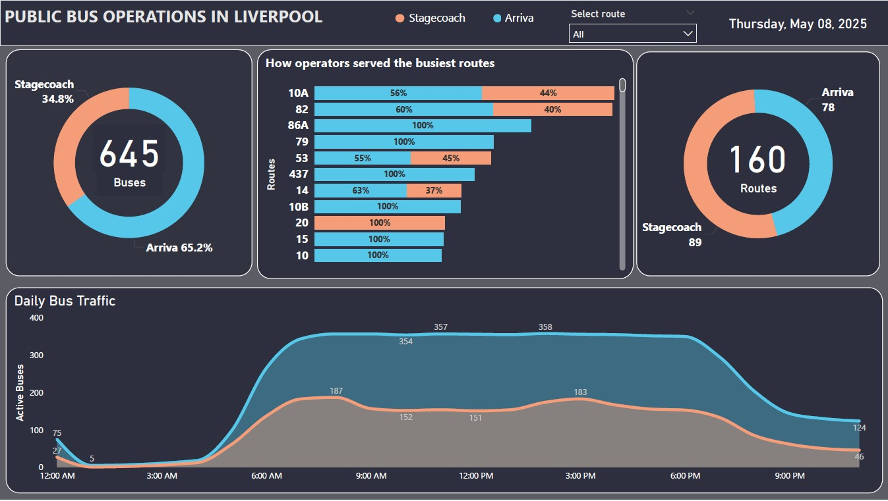
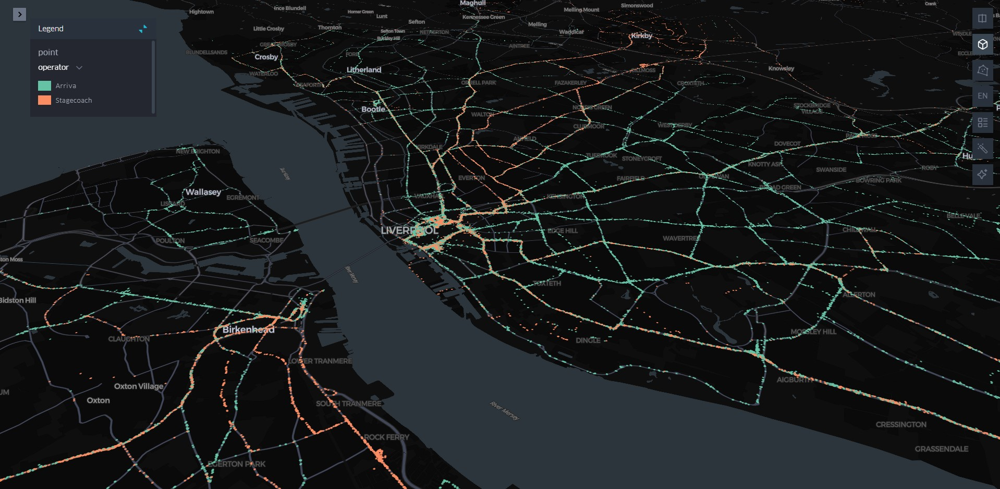

# Azure Data Pipeline for Liverpool Public Bus Activity.

## Overview

This project builds a scalable Azure data pipeline solution to collect, store and process public bus location data in Liverpool via the **Bus Open Data Service (BODS)** API.

## About BODS

BODS has open data published by the operators of local bus and coach services across England which are timetable, location, fares and disruption data and this has been possible through The Bus Services Act 2017 that requires local bus operators in England to provide specific data between 2020 and 2021. 

BODS offers free, license-free access to this information and allows users to give feedback to data publishers.

## Why store this data?

Currently, the Bus Open Data Service (BODS) only provides live location data, meaning there is no historical record to analyze trends, identify recurring issues, or build predictive models. By collecting and storing historical bus tracking data, we can analyze operational trends, predict potential delays, and improve service planning.

### Business Use Cases

- Transport Authorities & City Planning need historical data used to make decisons to improve route planning, predict delays, and enhance public transport efficiency.

- Bus Operators can leverage insights from analysis of the historical data to benchmark performance and make strategic decisions to gain a competitive edge or break monopoly in certain regions.

- Help public transport users save money on tickets for routes with multiple operators, reduce travel time, and improve their commuting experience.

## Requirements

- [ BODS gov.uk ](https://data.bus-data.dft.gov.uk/) account to get access to API documentations and API key.

- Azure account or create a free account.

- Fundamentals of **Azure Data Engineering**, **Azure Data Factory**, **Azure Data Lake Gen 2**, **Azure Databicks**, **Azure Synapse Analytics**, **Power BI**.
- [ Medalllion lakehouse architecture](https://learn.microsoft.com/en-us/azure/databricks/lakehouse/medallion)

- Pyspark, SQL / T-SQL

## Pipeline Overview

This [ guide](https://github.com/adekolaolat/bods-liverpool-azure-data-engineering/blob/main/README.md#implementation-steps) is a walkthrough for implementing a scalable Azure pipeline that pulls real-time bus location data from Liverpool’s main operators(Arriva and Stagecoach) using the BODS API. Azure Data Factory handles the data ingestion, dropping it into Azure Data Lake (bronze). Databricks then cleans and transforms it into structured (silver) and enriched (gold) data, adding logic like idle detection and tracking movement through Liverpool. The gold data is made queryable via Synapse, and Power BI turns it into a daily bus operations reports.

## Implementation Steps
- [ Understand how to interact with the BODS API endpoint. ](https://github.com/adekolaolat/bods-liverpool-azure-data-engineering/blob/main/guides/bods-data-guide.md)
- [ Data ingestion - Use Azure Data Factory to collect and store live location data to a Azure Data Lake Storage.](https://github.com/adekolaolat/bods-liverpool-azure-data-engineering/blob/main/guides/data-ingestion.md)

- [Transformation - Tranform raw data (bronze level) using Azure Databricks into silver level](https://github.com/adekolaolat/bods-liverpool-azure-data-engineering/blob/main/guides/transformation.md)

- [Transformation - Tranform silver data to gold tables using Azure Databricks.](https://github.com/adekolaolat/bods-liverpool-azure-data-engineering/blob/main/guides/transformation.md#getting-gold-layer-from-silver)

- [Data Warehousing – Connect Azure Synapse Analytics to the gold data stored in Azure Data Lake for efficient querying and reporting.](https://github.com/adekolaolat/bods-liverpool-azure-data-engineering/blob/main/guides/data-warehousing.md)

- [Visualisation -  Set up Power BI to report/dashboard to view daily bus operation.](https://github.com/adekolaolat/bods-liverpool-azure-data-engineering/blob/main/guides/data-viz.md)

*The steps integrates data governance and security throughout the implementation process, which ensures that right access is granted to resources and sensitive info like API keys, access keys, etc  are protected as required in a data engineering scenario.*

## Results

- #### Analytic Workload-  Daily report showing figures on how public buses serve Liverpool and surrounding regions

- #### Processed data used to map out trails for Arriva and Stagecoach buses on May 8th 2025.

Shows how Arriva serve many routes within Liverpool, while Stagecoach mostly covers routes heading out of the city. It also highlights busier spots — mainly bus stations — which are destinations points for inbound buses.

