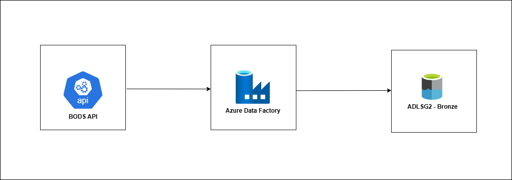

# Data Ingestion




For data ingestion, I’ll be using two resources - Azure Data Factory (ADF) and Azure Data Lake Storage Gen2 (ADLS Gen2).

I’ll like to collect the live bus location data every 5 minutes and storing the raw files saved in ADLS Gen2. Azure Data Factory will handle the orchestration, automating the process of calling the BODS API and saving the responses into the correct location in the data lake.

In ADLS Gen2, I’ll store a configuration file for the operators I need to make my API calls dynamic and also store the raw data, organized in a way that makes it easy to query later. Each raw data file will follow a consistent naming structure that includes the bus operator code and the timestamp of when the data was collected, making it simple to track and manage.

## Task requirements
- Schedule and automate API calls every 5 minutes
- Store responses into Azure Data Lake Gen2 container.
- File should be organised in a queryable stucture, using a file naming convention that includes the operator code and timestamp.
- Keep a config file in ADLSG2 to map API call for each bus operator.

## Azure Concepts applied
- [Pipelines and Activities](https://learn.microsoft.com/en-us/azure/data-factory/concepts-pipelines-activities?tabs=data-factory)
- [Linked Services](https://learn.microsoft.com/en-us/azure/data-factory/concepts-datasets-linked-services?tabs=data-factory)
- [Datasets](https://learn.microsoft.com/en-us/azure/data-factory/concepts-datasets-linked-services?tabs=data-factory)
- [Parameterizing Linked Services](https://learn.microsoft.com/en-us/azure/data-factory/parameterize-linked-services?tabs=data-factory)
- [Pipeline expression languages and functions](https://learn.microsoft.com/en-us/azure/data-factory/control-flow-expression-language-functions)
- [Triggers](https://learn.microsoft.com/en-us/azure/data-factory/concepts-pipeline-execution-triggers)
- [Security - Store credentials in Azure key vault](https://learn.microsoft.com/en-us/azure/data-factory/store-credentials-in-key-vault)  -**TO DO**
- [Security - Use Azure Key vault in pipeline activities](https://learn.microsoft.com/en-us/azure/data-factory/how-to-use-azure-key-vault-secrets-pipeline-activities) -**TO DO**


## Setting up Azure Resources

Azure resources and pipelines  was set up using the Azure portal in this project. However, it can also be set up other ways using CLI, Powershell, etc. 

<details><summary><b> Skip Me! </b></summary>

JSON for the final pipeline, activities and dataset set up can be found [here](https://github.com/adekolaolat/bods-liverpool-azure-data-engineering/blob/main/guides/data-ingestion-json.md)

</details>


### 1. Set up Azure Data Lake Gen 2
Open Azure portal and :

**Create Storage**

- Create a new resource and choose "**Storage account**"
- **Configure** :
  - Azure subscription ( A free accouunt would most likely have the name **"Azure Subscription 1"**)
  - Resource group as `livbusbods` (this is a new resource group which will hold all our resources including ADF resource and future resources we would like to use in the project)
  - Storage name  as `livbusdatastore` 
  - Region as UK West  (Use your prefered region)
  - Performance: Standard
  - Redundancy: LRS

- Under "**Advanced**", enable **Hierarchical namespace**. This is required for ADLSG2 storage.
- Click "Review + create" to complete the storage set up

 **Create Containers**

  - Open the created storage (`livbusdatastore`)
  - Navigate to "Data Storage" and select "Containers" 
  - Create two containers:
    -  `bronze` (access level set to Private) - this will hold our raw data.
    - `config` - this will hold the config file used in making API call for each bus operators 


### 2. Set up Azure Data Factory

- Go to **"Create resource"** → **"Integration"** → **"Data Factory"** or search Data Factory
- Configure:
  - Resource group : choose `livbusbods`, same group as ADLG2
  - Name: `livbusbods-adf`
  - Version: `V2`
  - Region: `UK West`

Click "Review + create" → "Create" to complete the set up for the Azure Data Factory.

### **One more thing !** - Create the config file

I've set up a simple config file to keep things organized. This file stores the bus operator codes and their corresponding data feed IDs, which are essential for making the API calls and saving the data in the correct path for each operator.

I used a JSON format so the setup can be  clean and easy to manage. It will also make the pipeline dynamic and scalable. If I want to add more bus operators in the future, all I need to do is update this one file.

Create an [ operators.json](https://github.com/adekolaolat/bods-liverpool-azure-data-engineering/blob/main/notebooks/operators.json) file and add this code to it:

```
[
    { "operator": "AMSY", "apiEndpoint": "datafeed/708" },
    { "operator": "SCCU", "apiEndpoint": "datafeed/1695" }
]

```
*where AMSY is for Arriva Merseyside and SCCU is for Stagecoach NW*

Add the json file by uploading to the `config` container.

- Navigate to  `livbusbods` → `livbusdatastore`→  Containers →  `config` and upload the file.

Now, we have ADLSG2 all set up for our pipeline.

## Building the pipeline in ADF

I want this pipeline to start by **looking up** the `operator.json` file stored in the `config` container in ADLS Gen2.

**For each** operator listed in that file, the pipeline should use the details to make an HTTP GET request to the BODS API to fetch the raw data.

Once the data is retrieved, it should be moved (**copied**) into the `bronze` container in ADLS Gen2 for storage.

How do we build this process/pipeline?

This process into several activities:
 
    First Activity is to look up the the config container for the operator.json file.
 
    Second Activity goes through each content over the config file

        and move data copied from the BODS data source via HTTPS to ADLSG2 container per operator. - Third Activity

So, for the pipeline I'll need 3 Activities:

1. **Look up Activity**
2. **ForEach Activity**
    
    3. **Copy Activity** 


### Implementing pipeline in ADF


Launch ADF studio by navigating to `livbusbods-adf` resource

Go to **Author** → Factory Resources 

and Create a new pipeline and name it `pullbodstobronze`

#### 1. Add Lookup activity

Under Activities search for Lookup. 

Drag and Drop it into the pipeline pane.

Set name of Lookup activity to `LookupBusOperators`

Go to Settings tab
Add a source dataset, which will reference the config file 
 - Create new Source dataset

- **Create Linked Services Dataset for the Bus Operators using the operators.json file**

  - Search for "Azure Data Lake" and select ADLSG2
  - Select JSON as format
  - Set Name to `BusOperators`
  - Under Linked Service, Create a new Linked service
  - Set the name to `BusOperators`- not necessarily the same as Dataset name, but I like it. Add description
  - Select AutoResolveIntegrationRuntime - I want Azure to mange this.
  - Select Account key as Authentication 
  - Choose your Azure Subcription (`Azure Subscription 1`)
  - Select Storage account - `livbusdatastore` - where our operator.json file lies 
  - Click on Create.
  - Under **Connection** tab, select Linked service as `BusOperators`, Choose the file path to the `operators.json` file

    


  - Test the connection - the output should be the content of the  file.

  Go back to `LookupBusOperators` Activity in the pipeline
  
  - Under **Settings**, select `BusOperator` as **Source dataset**
  - Uncheck **First Row only**

**The Look up activity is now set up to point to the config file** (`operator.json`)

#### **2. Add ForEach activity**

- Drag and drop the For Each activity

- Under Activities search ForEach. 

- Drag and Drop it into the pipeline pane.

- Set name of activity to `ForEachBusOperator`

- Connect `LookupBusOperators` Activity to `ForEachBusOperator` using `on success` arrow.

- Go to Settings tab

  - Add this code to Item field  as dynamic content  `@activity('LookupBusOperators').output.value`

  - This is a pipeline expression and which gets the value from the `LookupBusOperator` i.e. the data in the config file.

ForEach activity is now almost set up. 

Next step is to add the Copy Activity to the `ForEachBusOperator` Activity.
 

#### **3. Add Copy activity**

The Copy Activity is used to move data from a **source** to a **sink (or destination)**.

In my case, the source will be the BODS API endpoint, and the sink will be Azure Data Lake Storage Gen2 (ADLS Gen2).

Eventually, I want to store the data in the `bronze` container using a specific folder structure based on a timestamp format.

But before we get to that, let’s start by setting up the source dataset in the Copy Activity. Since I want the API calls to be dynamic, I’ll be using pipeline and dataset parameterization. 

So first up, let’s create the dataset for the source

#### Create Source dataset for Copy activity

My source dataset would reference the BODS API endpoint, so I need to to grab the data feed ID for each bus operator. I'll pass the data feed information, stored as `apiEndpoint` in the config file as a parameter to this dataset.

Got to Factory Resources

- Select the Copy Activity in `ForEachBusOperator`
-  Set Name to `CopyBODSRawData`
- Go to **Source** tab, and Create new Source dataset
 - Search for "**HTTP**" and select **HTTP**
  - Select "**XML**" as format
  - Set Name to `httplinkedservicebodsnorthwest`
  - Under Linked Service, Create a new Linked service
  - Set the name to `httplinkedservicebodsnorthwest`- not necessarily the same as Dataset name, but I like it. Add a description
  - Select `AutoResolveIntegrationRuntime` - I want Azure to manage this.
  - Select "**Base URL**" as `https://data.bus-data.dft.gov.uk/api/v1/`
  - Set "**Authentication type**" to "**Anonymous**"
  - Enable "**Server certificates validation**"
  - Test connection
  - Click on Create.
  
  Go to `httplinkedservicebodsnorthwest` dataset
  - Select `httplinkedservicebodsnorthwest` as the Linked service.
  - Go to Parameters tab and create a new parameter 
    - Name : `apiEndpoint`.
    - Type : String. *Leave default value empty*
  - Go back to Connection tab and add the code as dynamic content to **Relative URL**
  ```
  @concat(dataset().apiEndpoint, '?api_key=your_apikey')

  this attaches the datafeed endpoint for each operator along with the api key. to make the request.
  ```
  - Click OK to finish source dataset configuration.

  - Go Back to `CopyBODSRawData` activity under Dataset properties, add `@item().apiEndpoint` as dynamic content. This will allow the Copy Activity to grab the data feed value int the ForEach activity.
  - Set **Request method**  to `GET`
  - **Source dataset is now set up**

#### Create Sink dataset for Copy activity

For Sink, the dataset will point to the ADLSG2  and would want to save the response to the `bronze` container in the format below  format to meet the requirement. 

```

 /bronze/
    /operator=AMSY/
      /year=yyyy/
        /month=MM
            /day=dd/
                operator_YYYYMMDD_HHMMSS.json
    /operator=SCCU/
      /same_structure/

```
so, I'll be using two parameters here, One is the operator name and a trigger time parameter which would be the current time the data is received (or close)

Let's set up the Sink data now since we have and idea of how it should look.
- Select the `CopyBODSRawData` activity in `ForEachBusOperator`activity in the pipeline pane.
- Go to **Sink** tab, and Create new Sink dataset
 - Search for "**Azure Data Lake**" and select **ADLSG2**
  - Select "**JSON**" as format. file format will now be saved in JSON, rather than XML. The content the remain the same.
  - Set Name to  `ADLS2LinkedServiceBODS_bronze` 
  - Under Linked Service, Create a new Linked service
  - Set the name to `busdatatobronze_adls2`- not necessarily the same as Dataset name. Add a description
  - Select `AutoResolveIntegrationRuntime` - I want Azure to manage this.
- Select **Account** key as the Authentication 
- Choose your Azure Subcription (`Azure Subscription 1`)
- Select Storage account - `livbusdatastore` (ADLSG2)
- Test Connection to Linked service ans **Save**
  
  Go to `ADLS2LinkedServiceBODS_bronzet` dataset
  - Select `busdatatobronze_adls2` as the Linked service.
  - Go to Parameters tab and create a new parameter s
    - Name : `operator`.
    - Type : String. *Leave default value empty*
    - Name : `triggerTime`.
    - Type : String. *Leave default value empty*
  - Go back to Connection tab and in **File path**, select Browse and choose `bronze` as root folder 
  - Select the next directory field in **File path** and add the add the expression below as dynamic content. This creates the file path structured by operator, year, month and day.
```
@concat(
  'operator=', dataset().operator, 
  '/year=', formatDateTime(dataset().triggerTime, 'yyyy'),
  '/month=', formatDateTime(dataset().triggerTime, 'MM'),
  '/day=', formatDateTime(dataset().triggerTime, 'dd'), 
  '/'
)
```
  - Select the File name field in **File path** and add the add the expression below as dynamic content. This will save the file in the described format.
```
  @concat(
  dataset().operator, '_',
  formatDateTime(dataset().triggerTime, 'yyyyMMdd_HHmmss'),
  '.json'
)
```

- Go Back to `CopyBODSRawData` activity. 
  - Under Sink, In  Dataset properties, add `@item().operator` as dynamic content value for `operator` parameter. This will allow the Copy Activity to grab the operator value in the ForEach activity.
  - Add `@convertFromUtc(utcNow(),'GMT Standard Time')` as dynamic content value for `tiggerTime`. This will save the current time in GMT and will use paseet to the dataset for the naming structure .

The Sink configuration is now set up for `CopyBODSRawData` activity.

Our `pullbodstobronze` pipeline for ingestion of the data is now almost complete.

#### Adding a Trigger to the Pipeline
Now, we need to add a 5 minutes trigger to the pipeline. The trigger is straightforward to configure. This was the configuration used in this project.

- Click on `Trigger` at the top of the pipeline pane
-  Add a New Tigger and set name to `BODS_5min`
 - Choose `ScheduleTrigger` as **Type**
  - Select a **Start date/time**.
  - Set Name to  `ADLS2LinkedServiceBODS_bronze` 
  - Choose Time Zone  to be `Dublin, Edinburgh, Lisbon, London (UTC+0)`
  - Set **Recurrence** to `5 minutes`
  - Choose **Status** to be `Started`


#### Deploying the Pipeline

The pipeline can be published after resolving any validation error that may pop up. If ready, Click on the **Publish all** button at the top of the Data Factory window, validate the pipelines and triggers and Publish.

A message should pop up at the top right showing the pipeline has been published successfully.


### Outcome

By navigating to the storage account, the deployed pipeline is now automatically collecting raw data from BODS every 5 minutes. It’s also storing the data using the directory and file naming structure that was designed.

If needed, I can easily configure the pipeline to collect data from additional operators, by updating the `operators.json` configuration file.


- **Dynamic naming structure for raw data automatically collected and partitioned for each day**


- **Each operator directory in the bronze container  is created dynamically**


### JSON

JSON for the final pipeline, activities and dataset set up can be found [here](https://github.com/adekolaolat/bods-liverpool-azure-data-engineering/blob/main/guides/data-ingestion-json.md)
  

[⏮️ Go to Implementation Steps](https://github.com/adekolaolat/bods-liverpool-azure-data-engineering/blob/main/README.md#implementation-steps)

[⏭️ Transformation](https://github.com/adekolaolat/bods-liverpool-azure-data-engineering/blob/main/guides/transformation.md)


